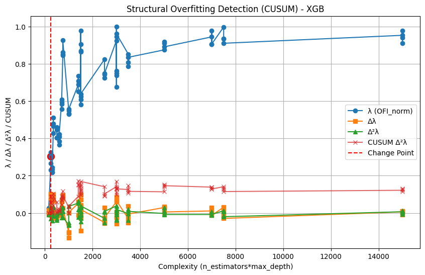
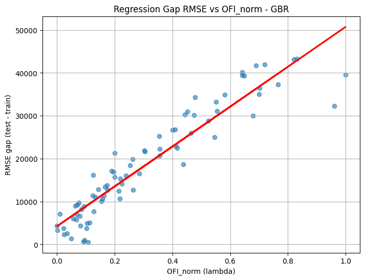
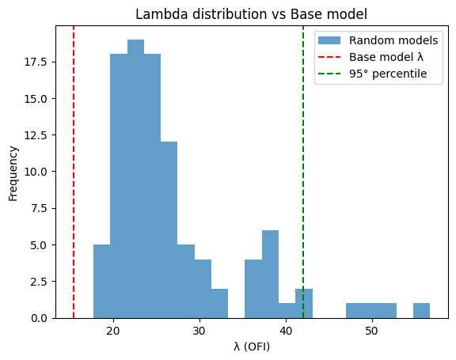

# λ-Guard: Structural & Stability Overfitting Index for Gradient Boosting

## Overview

The **λ-Guard** framework is designed to detect overfitting **without using a test set**. Instead of relying on loss values, it analyzes the **geometric structure of the learned representation** and the stability of predictions under small perturbations.

It decomposes the model into two key spaces:

1. **Representation Space (Capacity)** – captures the structural complexity of the model in terms of how the input space is partitioned.  
2. **Prediction Trajectory Space (Alignment)** – measures how effectively each component (tree) contributes to the predictive target.

Each tree in Gradient Boosting partitions the input space into leaf regions. We define a **binary matrix \(Z\)**:

\[
Z_{i,j} =
\begin{cases}
1 & \text{if observation } i \text{ falls in leaf } j\\
0 & \text{otherwise}
\end{cases}
\]

- Rows correspond to observations  
- Columns correspond to leaf regions across all trees  

This matrix acts as a geometric analog to the **hat matrix (\(H\))** in linear regression: it encodes how the model “projects” the training data into its learned representation.

## Components of λ-Guard

### 1. Capacity \(C\)

The **capacity** measures the intrinsic complexity of the learned representation:

\[
C = \mathrm{Var}(Z) = \frac{1}{n} \sum_{i=1}^n \| Z_i - \bar{Z} \|^2
\]

- High \(C\) → many independent regions (complex partitioning)  
- Low \(C\) → few effective regions → simpler model  

### 2. Alignment \(A\)

Alignment quantifies how well the learned representation predicts the target:

\[
A = \mathrm{Corr}(f(X), y) \quad \text{or equivalently } A = \mathrm{Var}(f(X))
\]

- High \(A\) → each tree contributes independent functional information  
- Low \(A\) → later trees are almost linear combinations of earlier ones  

### 3. Generalization Index (GI)

The **generalization index** measures the balance between alignment and capacity:

\[
GI = \frac{A}{C}, \quad
G_{\text{norm}} = \frac{A}{A + C} \in [0,1]
\]

- \(G_{\text{norm}} \to 1\) → strong generalization  
- \(G_{\text{norm}} \to 0\) → high capacity, low alignment → potential overfitting  

### 4. Instability Index \(S\)

Measures sensitivity to small input perturbations:

\[
S = \frac{1}{n} \sum_{i=1}^{n} \frac{|f(x_i) - f(x_i + \epsilon_i)|}{\sigma_f}, \quad \epsilon_i \sim \mathcal{N}(0, \sigma_\epsilon^2)
\]

- High \(S\) → model is unstable → small input changes lead to large prediction shifts → overfitting  

---

### 5. Overfitting Index (λ)

Combines structural complexity and stability:

\[\lambda = \frac{C}{A + C} \cdot S\]

- High λ → many independent regions that **do not contribute to alignment**, plus unstable predictions → overfitting  
- Can also normalize to [0,1]:

\[\lambda_{\text{norm}} = \frac{\lambda - \min(\lambda)}{\max(\lambda) - \min(\lambda)}\]

## 6. Lambda - Overfitting Test

# λ-Guard Test for Structural Overfitting

The **λ-Guard test** detects structural overfitting in gradient boosting models **without using a test set**.  
It analyzes how much the model relies on each training point, identifying both **global complexity** and **local memorization**.

---

## Overview

1. **Compute leverage H_ii** for each training point `i`:
H_ii ≈ sum over trees of (learning_rate / size of leaf containing i)

2. **Compute observed statistics**:

- **T1 (global complexity / effective DoF ratio)**:
T1 = mean(H_ii)

- **T2 (local memorization / peak leverage ratio)**:

---

## Bootstrap Null Distribution

- Generate `B` bootstrap samples of the training set.
- Compute T1 and T2 for each sample:
T1_b = mean(H_ii^b)
T2_b = max(H_ii^b) / mean(H_ii^b)

- These form empirical null distributions under a **stable model** assumption.

---

## Hypothesis Testing

- **Null hypothesis (H0):** model is structurally stable  
- **Alternative hypothesis (H1):** model exhibits overfitting  

- Compute empirical p-values:

p1 = fraction of T1_b >= T1_obs
p2 = fraction of T2_b >= T2_obs

- **Decision:** reject H0 if `p1 < alpha OR p2 < alpha`

> Either a high global complexity (T1) or a high peak leverage (T2) is enough to flag overfitting.

---

## Interpretation

- **Mean(H_ii)** → global model complexity  
- **Max(H_ii)/Mean(H_ii)** → local memorization  

Models can be classified as:

1. Stable / smooth generalization  
2. Global overfitting / interpolation  
3. Local memorization / spike-dominated  
4. Extreme interpolation (both T1 and T2 high)

---

## Geometric Interpretation

1. **Matrix \(Z\)** represents the **geometric projection** of observations into leaf regions.  
2. **Capacity \(C\)** measures the “dimensionality” of this projection.  
3. **Alignment \(A\)** captures how well this projection is aligned with the target.  
4. **Instability \(S\)** detects sensitivity to perturbations.  
5. **λ** = normalized “overfitting score” derived entirely from **training data**, without test set or OOF folds.  

Geometric interpretation of Lambda-Guard. Gray squares: leaf regions, blue points: original observations, red points: instability, green arrows: alignment. High lambda occurs when capacity is high, alignment low, and instability high

Essentially, λ-Guard generalizes the concept of the hat matrix \(H\) to Gradient Boosting models: it measures **how much of the learned representation is used productively versus wasted**, geometrically.

### References / Inspirations

- λ-Guard derived from the geometric structure of the boosting hat-like matrix (Z / pseudo-residual projection)
- Gradient Boosting as a functional additive model  
- Generalization Index (GI) framework

